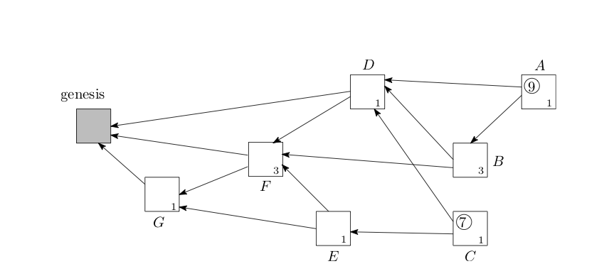
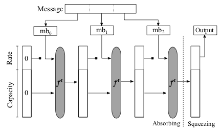
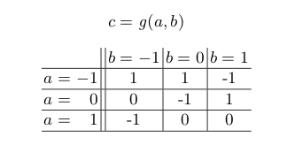

# ブロックチェーン米国市場調査　報告書

## この報告書について
この報告書は、ブロックチェーン技術の最新動向として、特に以下の2つにフォーカスして調査をおこなったものである。

- ブロックチェーンの有力な応用先として考えられているIoT分野について、特にIoTに特化したプロジェクトであるIOTAの動向を中心とした現状の調査結果
- ISO TC307などの国際標準化、日本国内の動向、および国際会議における新規技術開発の方向性

本報告書の内容は、2019年3月20日時点のものであり、その後の動向については反映されていないことに注意が必要である。

## IOTAについての調査
### IOTAプロジェクトの概要（1p）
ブロックチェーンは、支払いや決済をはじめとして、様々なトランザクションを実行する基盤として注目を集めている。様々なアプリケーションが検討されている中で、IoT（Internet of Things）は、有力なユースケースの1つと考えられている。その理由は、分散したIoTデバイス間で発生するトランザクションの基盤として有効と考えらること、IoTアプリケーションおける課金では、マイクロペイメントが多用される可能性が高いため、マイクロペイメントの処理を行う基盤としてブロックチェーン上の通貨やトークンが有効あると考えられているためである。

[IOTA](https://www.iota.org)は、そのようなIoT用途にフォーカスを当てた、マイクロトランザクションとデータの非改ざんを目的とした分散型台帳プラットフォームである。IOTAが解決しようとしている課題は、主にはBitcoinなどのブロックチェーン技術がもつスケーラビリティ問題である。（パブリック）ブロックチェーンでは、分散合意を含めたセキュリティを保ちながらブロックサイズを大きくすることは困難であり、ビットコインの現在の仕様では、Layer2技術を使わない場合、系全体で、1秒あたり7トランザクション程度しか処理することができない。IOTAではこの問題を解決する技術的手段として、後述するDAG（有向非巡回グラフ）を用いている。IOTAではこれをTangleと呼んでいる。

IOTAは、Tangleを使うことの効用として、以下の点を挙げている。

- スケーラビリティの向上
- 省リソースデバイスでも実行可能であること
- トランザクション手数料が0であること
- データに関するセキュアな送信
- オフライン処理の許容
- 耐量子計算機

以上については、次節以降において概要と現時点で明らかになっている評価を示す。

IOTAに関する活動、プロダクトの開発は、IOTA財団が主体となって行なっている（IOTAの開発自身はオープンソース）。IOTA財団は、2017年にドイツで正式に登録された非営利組織（NPO)である。IOTAは、IOTAトークンを発行し、いわゆるICO（Initial Coin Offering）によって、2015年の11月と12月に、$500,000相当の暗号通貨建てで資金調達を行なっている。IOTA財団によると、このトークンについて設立者やデベロッパーには特別な配分はなされていないとする。そのほかに、政府からのグラントや寄付などを収入源とするとしている。この報告書の執筆時点でのマーケットキャップは、$775,556,954である（約850億円相当）である。また、IOTAにはBoschが出資をしている。

### IOTAプロトコルの概要（2p）
本節では、IOTAプロトコルの概要を述べる。

#### DAG（有向非巡回グラフ）
IOTAで用いられているのは、ブロックチェーンのようにブロックのハッシュ値を一連のチェーンのようにつなぐのではなく、DAG（有向非巡回グラフ）というデータ構造である。
ブロックチェーンは、トランザクションを塊としてブロックの単位で扱い、そのブロックに対してネットワークに参加するノードで合意することで、台帳の更新を行なっていく。そのため、ブロックのサイズが性能上の制約となっている。IOTAは、この性能上の制約の問題を解決するために、複数のトランザクションを集約するのではなく、新しいトランザクションを起こすノードが過去の2つのトランザクションを承認し、そのトランザクションの後に自分のトランザクションが存在すること示すデータを追記することで、トランザクションの前後性に関する証拠をつなげていく。このようなやり方をとる場合、ブロックチェーンのようなチェーンのようなデータ構造になるのではなく、個々のノードがトランザクションを作るときに関係付けるトランザクションの依存関係は、より複雑な構造となる。IOTAでは、この依存関係を有向非巡回グラフ（Directed Acyclic Graph: DAG）として表現する。

図：IOTAにおけるDAG

IOTAのWebページによると、IOTAの特徴として以下の点が主張されている（主張であることに注意）。
•	スケーラビリティ問題の解消
一定時間当たりの台帳のデータサイズの区切りがないため、この点においてスケーラビリティの問題が存在しない。
•	トランザクション手数料が不要
トランザクションを発生させたノードが台帳データの更新を行うため、IOTAの仕様上、トランザクション手数料は存在しない。
•	非中央集権化
マイナーが存在しないため、台帳の管理という観点では中央集権化が発生しない。
•	量子計算機耐性
新しく開発されたCurlハッシュ関数の仕様により、量子計算機耐性がある。

　IOTAのためのコインも発行されている。これがICOのような形で、IOTA財団の活動資金となっている。一方で、IOTAコインの取引の金額と、不要になったはずの手数料などとの関係が曖昧であることは問題点である。
　技術的にはDAGは、ブロックチェーンの問題を解決する可能性がある手法として、一定の注目は浴びているものの、DAGのような形態を利用した分散台帳が本当に安全であるのか、については信頼に足る研究成果がないのが現状で、現状では多くの疑問が呈されている。

#### 3進計算機

IOTAの演算においては、2進数ではなく3進数の演算が定義されて用いられている。IOTAでは、これをTritsと呼び、(-1, 0, 1)のどれかの値を取ると定義している。また、3 tritsをまとめた単位をTrytesと呼んでいる(2進数におけるバイトに相当)。

#### 電子署名アルゴリズム
IOTAでは、Wintermitzのワンタイム署名（WOTS）を署名アルゴリズムとして用い、Curl-P-27ハッシュを計算した値に対して、WOTS署名を計算している。ここで、署名対象はトランザクションのデータそのものではなく、ハッシュを計算した後のデータであるため、ハッシュへの攻撃（例えば2nd pre-image）が成功すると、IOTAで用いる有効な電子署名の偽造に成功することになる。

#### Curl-P-27ハッシュ関数
IOTAにおいては、Curl-P-27がハッシュ関数として使われていた。これは、SHA-3であるKeccakのサブセット版に相当する。SHA-3と同様にスポンジ構成になっている。

そのため、セキュリティはTransformation関数tの性質に依存する。Curl-P-27のTransformation関数tは、パーミュテーションと簡単なS-BOXにより構成されている。

#### Current status of security evaluation on DAG and Tangle
- Side Tangle Attack

#### 現状の技術評価

- スケーラビリティの向上
- 省リソースデバイスでも実行可能であること
- トランザクション手数料が0であること
- データに関するセキュアな送信
- オフライン処理の許容
- 耐量子計算機
- セキュリティ

<!--以下今晩-->

### IOTAプロジェクトについて指摘されたセキュリティ上の問題点と対応経緯（2p）
#### Curl ハッシュ関数の安全性の指摘
MITとボストン大学の研究者によって、IOTAに使われているCurlハッシュ関数と電子署名の仕様に対する攻撃が手法の概要と実例とともに示されている 。
Curlハッシュ関数はSHA3の仕様のサブセットを利用して作られているが、このハッシュ関数そのものの仕様に暗号学的に大きな問題が存在し、暗号学的なハッシュ関数としては安全ではなく、IOTAのトランザクション生成に対する攻撃が行えることを示している。

- Attack on Curl
Ethan Heilmanらによる論文によると、Curl-P-27のコリジョンを発見する例として、あるランダムなメッセージを選び、そのメッセージの第26tritを反転させたメッセージについてコリジョンとなる確率が最低で$1/(2^{42.40})$となることが示されている。これは23ビットセキュリティ（46ビット出力のハッシュ関数）に相当する。
現実の攻撃には、第81tritを変えることで、トランザクションの有効性に影響を与えることなく、コリジョンを利用することができる。

- Real attack demo
- Timeline
上記の論文を発表した研究グループは、2017年7月にIOTAの開発グループに対して脆弱性を提示した。その結果としてIOTAの開発グループはCurl-P-27を、別のハッシュ関数である[Kerl](http://github.com/iotaledger/kerl)に置き換えた。

一方で、IOTAの開発チームは、これをコピープロテクション目的のバックドアと主張した。
上記の脆弱性の開示は、Responsible Disclosureの手続きに則って行われたが、IOTA側の問題解決に対する動きが遅く、IOTA財団とMIT DCI（Digital Currency Initiative）による批判の応酬となっている。現時点では、指摘された問題については修正がなされているが、MIT DCIからは、ICOの正当性を含めてIOTAのプロジェクトそのものについての疑義が示されている。公式になされているアクションは、MIT DCI側からは2017年12月20日付の伊藤穰一所長名での問題点を指摘するステートメント であり、IOTA側からは2018年1月7日付の、ブログ記事による返答 である。2018年2月には、両者の内部のやり取りのメールが何者かによってネット上に公開されている 。

### IOTA財団の対応における組織的な問題点（2p）
- Summary from tangle blog
http://www.tangleblog.com/wp-content/uploads/2018/02/letters.pdf
- https://thebitcoinnews.com/mit-criticizes-iota-gaping-hole-in-its-software-and-deceptive-marketing/
- https://blog.iota.org/official-iota-foundation-response-to-the-digital-currency-initiative-at-the-mit-media-lab-part-1-72434583a2

### IOTAプロジェクトの新たな攻撃募集（1p）
- Call for attack to Troika
http://blog.iota.org/678e741315e8
http://blog.iota.org/615d2d79001

<!--以上今晩-->

### IOTAプロジェクトの現状
#### プロダクト
現状IOTAのノードを構成するウォレットプログラムがWindowsとMac版で提供されている。ソースコードとアプリケーションは、以下のURLからダウンロードできる。

https://github.com/iotaledger/wallet

このウォレットは、IOTAプロトコルのフルノード（Tangleを実行するし、データを蓄えるノード）と、ライトノードのいずれかを選んで実行することができる。

#### R&Dロードマップ
IOTAは、研究開発のロードマップとして以下の7つの項目を示している。

- Coordicide: IOTAにおける合意アルゴリズムの脅威分析、数学的なモデル化、シミュレーション、および形式化を行う。
- Spam prevention and detection: IOTAのDAGのネットワークに参加するデバイスの中から、以上なデバイスを取り除く技術の研究。
- Automatic peer discovery：DAGのネットワークに参加するデバイス（Peer）の自動発見を行うプロトコルの開発。
- Economic Incentives：より現実的なゲーム理論的な解析を行い、IOTAのインセンティブモデルと、ナッシュ均衡であるかどうかの研究。将来Tangleが広く普及し、スケールした際にもインセンティブモデルが正当に働くかどうかの検証する。
- Consensus Algorithm spec：IOTAの合意アルゴリズムについて、その詳細スペックを策定し、ピアレビューに掛ける。
- Cryptography spec：IOTAで使われている暗号プリミティブの研究。ハッシュ関数と電子署名、および脅威モデル。その成果を将来のピアレビューに掛ける。
- Attack analysis：合意アルゴリズムに対する攻撃の可能性の研究。

上記の研究開発テーマのリストからわかることは、IOTAの基本的なアルゴリズムでさえ、一定程度の検証を経たものがなく、安全性の検証という観点ではほぼ何もない状態でプロダクトの開発が行われていると考えた方が良い。これは前述の脆弱性の対応が不十分にできていない経緯と符合するものである。現状、ブロックチェーンや分散型台帳技術について、安全性証明を行うフレームワークは存在せず、また数年以内に一定の理解を得たフレームワークを作ることが難しいことを考えると、さらに解析が複雑、かつ異常系への対応などが不明なIOTAについて、5年の単位では実際のビジネスに展開するのは難しいと考えられる。技術的には、IOTAが採用していると主張している3進数による処理を含めて、技術的、理論的に疑問符がつく部分が大きく、十分な専門性を持ったチームとしてプロジェクトが進められていない可能性が大きいと考えられる。

### Alternative for IOT（1p）
- スケーラビリティ　機器数
- サプライチェーン
- トレーサビリティ
- Single Point

## 標準化および研究開発動向 (5p)
### ISO TC307の現状（3p）
ISO TC307は、ISOにおいてブロックチェーンおよびDLT(分散台帳技術）の標準化を行う技術委員会であり、2017年の4月にシドニーで第1回目の国際会議が開催されて以来、東京（2017年11月）、ロンドン（2018年5月）、モスクワ（2018年11月）と計4回開催されている。
  現在、TC307の組織は以下のように構成されている。

- WG1: Foundations
- WG2: Security, privacy and identity
- WG3: Smart contracts and their applications
- JWG4: Joint ISO/TC 307 - ISO/IEC JTC 1/SC 27 WG: Blockchain and distributed ledger technologies and IT Security techniques
- WG5: Governance
- SG2: Use Cases
- SG7: Interoperability of blockchain and distributed ledger technology systems

#### 標準化文書の現状

#### 今後の予定
TC307の将来の国際会議は以下のように予定されている。

- 2019年5月27日-31日：Dublin (Ireland)
- 2019年11月18日-22日：Visakhapatnam (India)

### 日本国内での取り組み（1p）
#### CGTF (Cryptoasset Governance Task Force)
コインチェックによる暗号資産の流出事件が2018年1月に発生したことを契機に、仮想通貨交換取引所のセキュリティ確保とガバナンスの確立が急務となった。これを受けて、日本のセキュリティ専門家と一部のブロックチェーン事業者の有志で、任意団体VCGTF（Virtual Currency Governance Task Force）が設立された。その後、金融庁の「仮想通貨交換業等に関する研究会」において、仮想通貨の代わりに暗号通貨という新しい呼称を用いる方針となったため、この任意団体の名称はCGTF（Cryptoasset Governance Task Force）に変更となった。金融庁は、仮想通貨交換取引所について、業界団体などによる自主規制を行う方針を取っている。一方で、仮想通貨交換取引所、およびブロックチェーン事業者としての業界団体が複数設立され、自主規制団体としてまとまった意思決定や行動ができる状態になっておらず、公式な自主規制の方針や基準ができないまま、コインチェックによる事件が発生した。公式な自主規制団体の設立と自主規制基準の作成が遅れたことが、仮想通貨交換取引所におけるインシデントの発生の可能性を高めたとも言える。

そのため、VCGTFが設立された当初は自主規制団体が存在しなかったが、将来、自主規制団体が設立されることを想定して、自主規制団体におけるセキュリティの基準として参照される文書を作成すること、必要によっては金融庁などに直接参照される文書を作成することがCGTFの目標である。

CGTFでは、主に仮想通貨交換取引所が、ISMS（ISO/IEC 27000シリーズ）に準拠したセキュリティマネジメントプロセスを実施することができるように、同標準に基づいたセキュリティ確保のためのプラクティスを記述した文書を作成している。その他に、暗号資産に関わる用語の定義を行う文書、ブロックチェーンシステムで使用しているウォレットに関する調査報告書を作成している。

##### 仮想通貨交換所のセキュリティ対策についての考え方
この文書は、仮想通貨交換取引所のセキュリティマネジメントについて、ISO/IEC 27002で規定されたフォーマットに従い、仮想通貨交換所システムのリスク分析を行い、セキュリティ対策のプラクティスをまとめている。現状、仮想通貨交換所のシステムについては、共通のアーキテクチャなどは存在せず、各事業者が自己流でシステムの設計、構築、運用を行なっている。そのため、この文書の作成に当たっては、可能な限りのブロックチェーン事業者からヒアリングを行い、システムのモデル化を行なった上で検討している。そのため、その他の仮想通貨交換所のシステムのセキュリティをカバーするためには、追加のヒアリング等が必要である。

この文書は、IETFのInternet Draft（I-D）として公開されている。またこの文書は、ISO TR23576（Security management of Digital Asset Custodians）にも入力されている。

- [IETF] General Security Considerations for Cryptoassets Custodians, https://datatracker.ietf.org/doc/draft-vcgtf-crypto-assets-security-considerations/
- [ISO TR23576] Blockchain and distributed ledger technologies -- Security management of digital asset custodians, https://www.iso.org/standard/76072.html

#####  Terminology for Cryptoassets
この文書は、仮想通貨（暗号資産）の技術文書を作成するにあたり、必要な用語の定義を行うために作られている。

この文書は、IETFのInternet Draft（I-D）として公開されている。

- [IETF] Terminology for Cryptoassets, https://tools.ietf.org/html/draft-nakajima-crypto-asset-terminology-01

##### 日本国内における仮想通貨ウォレットの実態調査
この文書は、金融庁の「仮想通貨交換業等に関する研究会」において、新たにカストディとウォレットのセキュリティに関する規制が検討されていることから、秘密鍵を管理するウォレットとカストディ機能について、現状の事業者がサービスとして提供しているものの実態を調査した報告書である。

CGTFの詳細について、[https://vcgtf.github.io](https://vcgtf.github.io) から参照することができる。

- Relationship to JVCEA

### その他の動向（1p）
#### 標準化団体
##### ITU-T
ITU-Tでは、引き続き
##### IETF
##### W3C

#### 学術会議
##### Financial Cryptography 2019
Financial Cryptography 2019は、2019年2月18日から22日まで、St. Kittsで開催された。昨年までは、併設のワークショップとしてBitcoin Workshopが開催されていたが、本年はこのワークショップをFinancial Cryptographyにマージする形となった。投稿本数が178本に対して採録が39本であり、採択率は21.9%と昨年の23.6%より少し減少した。昨年までとの大きな違いは、Bitcoin Workshopをマージしたことで、採録本数がほぼ倍増したことである。それでも採択率が変わらないということは、投稿本数も倍増に近かったことを意味している。なお、非公式ではあるが、投稿論文のほぼ半数がブロックチェーンに関連する論文という話があり、ブロックチェーンに関する学術研究が、Financial Cryptographyへの投稿に値するレベルで結果が出始めていると考えられる。

ブロックチェーンに関するセッションと論文は以下の通りである。

Session 2: Cryptocurrency Cryptanalysis
Session Chair: Ian Goldberg
Biased Nonce Sense: Lattice Attacks against Weak ECDSA Signatures in Cryptocurrencies. Joachim Breitner (DFINITY Foundation) and Nadia Heninger (University of California, San Diego)

Session 3: Proofs of Stake
Session Chair: Jens Grossklags
Snow White: Robustly Reconfigurable Consensus and Applications to Provably Secure Proofs of Stake. Phil Daian, Rafael Pass (CornellTech), and Elaine Shi (Cornell)

Compounding of Wealth in Proof-of-Stake Cryptocurrencies. Giulia Fanti (CMU), Leonid Kogan (MIT), Sewoong Oh (UIUC), Kathleen Ruan (CMU), Pramod Viswanath, and Gerui Wang (UIUC)

Short Paper: I Can’t Believe It’s Not Stake! Resource Exhaustion Attacks on PoS. Sanket Kanjalkar, Joseph Kuo, Yunqi Li, and Andrew Miller (UIUC)

Session 4: Measurement
Session Chair: Patrick McCorry
Short Paper: An Exploration of Code Diversity in the Cryptocurrency Landscape. Pierre Reibel, Haaroon Yousaf, and Sarah Meiklejohn (University College London)

Short Paper: An Empirical Analysis of Blockchain Forks in Bitcoin. Till Neudecker and Hannes Hartenstein (Karlsruhe Institute of Technology)

Detecting Token Systems on Ethereum. Michael Fröwis (University of Innsbruck), Andreas Fuchs (University of Münster), and Rainer Böhme (University of Innsbruck)

Measuring Ethereum-based ERC20 Token Networks. Friedhelm Victor and Bianca Katharina Lüders (Technische Universität Berlin)

Session 5: Traceability and How to Stop It
Session Chair: Rainer Böhme
New Empirical Traceability Analysis of CryptoNote-Style Blockchains. Zuoxia Yu, Man Ho Au (Department of Computing, The Hong Kong Polytechnic University), Jiangshan Yu (Monash University), Rupeng Yang (School of Computer Science and Technology, Shandong University and Department of Computing,The Hong Kong Polytechnic University), Qiuliang Xu (School of Computer Science and Technology, Shandong University), and Wang Fat Lau (Department of Computing, The Hong Kong Polytechnic University)

Short Paper: An Empirical Analysis of Monero Cross-Chain Traceability. Abraham Hinteregger and Bernhard Haslhofer (Austrian Institute of Technology)

PRCash: Fast, Private and Regulated Transactions for Digital Currencies. Karl Wüst, Kari Kostiainen (ETH Zurich), Vedran Capkun (HEC Paris), and Srdjan Capkun (ETH Zurich)

ZLiTE: Zcash Lightweight Clients using Trusted Execution. Karl Wüst, Sinisa Matetic, Moritz Schneider (ETH Zurich), Ian Miers (Cornell Tech), Kari Kostiainen, and Srdjan Capkun (ETH Zurich)

Session 9: Getting Formal
Session Chair: Gaby Dagher
Minimizing Trust in Hardware Wallets with Two Factor Signatures. Antonio Marcedone, Rafael Pass (Cornell University), and abhi shelat (Northeastern University)

A Formal Treatment of Hardware Wallets. Myrto Arapinis, Andriana Gkaniatsou (University of Edinburgh), Dimitris Karakostas, and Aggelos Kiayias (University of Edinburgh and IOHK)

VeriSolid: Correct-by-Design Smart Contracts for Ethereum. Anastasia Mavridou (NASA Ames), Aron Laszka (University of Houston), Emmanouela Stachtiari (Aristotle University of Thessaloniki), and Abhishek Dubey (Vanderbilt University)

Bitcoin Security under Temporary Dishonest Majority. Georgia Avarikioti, Lukas Kappeli, Yuyi Wang, and Roger Wattenhofer (ETH Zurich)

Session 10: Off-Chain Mechanisms and More Measurement
Session Chair: Sven Dietrich
VAPOR: a Value-Centric Blockchain that is Scale-out, Decentralized, and Flexible by Design. Zhijie Ren and Zekeriya Erkin (Delft University of Technology)

Sprites and State Channels: Payment Networks that Go Faster than Lightning. Andrew Miller (UIUC), Iddo Bentov (Cornell Tech), Surya Bakshi (UIUC), Ranjit Kumaresan (Visa Research), and Patrick McCorry (King's College London)

Echoes of the Past: Recovering Blockchain Metrics From Merged Mining. Nicholas Stifter (TU Wien), Philipp Schindler, Aljosha Judmayer (SBA Research), Alexei Zamyatin (Imperial College London), Andreas Kern (SBA Research), and Edgar Weippl (TU Wien)

TxProbe: Discovering Bitcoin's Network Topology Using Orphan Transactions. Sergi Delgado-Segura (UAB), Surya Bakshi (UIUC), Cristina Pérez-Solà (Universitat Rovira i Virgili), James Litton, Andrew Pachulski (UMD), Andrew Miller (UIUC), and Bobby Bhattacharjee (UMD)

また、2月22日に行われた併設ワークショップでは、ブロックチェーンに関係するものは2つ行われ、1つは例年と同じくスマートコントラクトを取り扱う3rd Workshop on Trusted Smart Contracts、もう1つは、暗号通貨の実装に関する新提案を発表する1st Cryptocurrency Implementers' Workshopである。

会議用の予稿は会議の[Webページ](http://fc19.ifca.ai/program.html)からダウンロード可能である。

##### Scaling Bitcoin
Scaling Bitcoinは、2015年に、主にブロックチェーンのスケーラビリティ向上のための技術について、利害関係を排除し、純粋に技術的な議論をエンジニアとアカデミアが協力して行う会議としてスタートした。2018年は、慶應大学と東京大学を中心にBASEアライアンスがアカデミックホストとなる形で、2018年10月6日、7日に行われた。2018年から、よりアカデミックに近い形での査読プロセスが導入され、エンジニアコミュニティから10人、アカデミアから10人から構成されるプログラム委員会により、採録が決定された。発表申し込み39に対して採録19で、採択率はほぼ50%である。

特に注目を浴びた発表は以下の通りである。

Scaling Bitcoin 2018の発表スライドとビデオは、[Scaling BitcoinのWebページ](https://tokyo2018.scalingbitcoin.org/presentations)から参照することができる。
