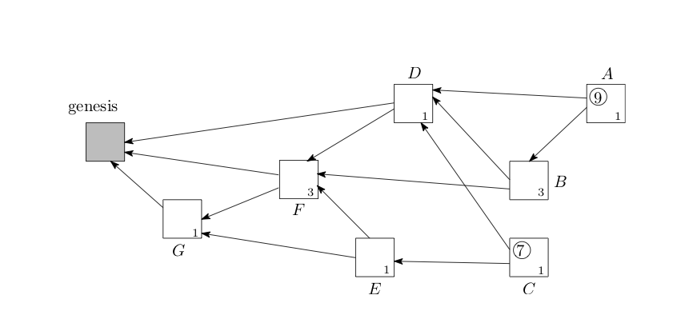
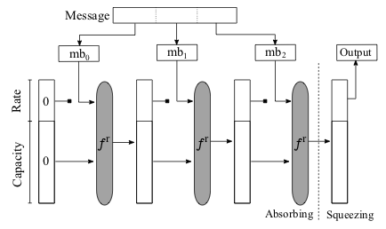
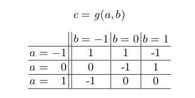

# ブロックチェーン米国市場調査　報告書

## この報告書について
この報告書は、ブロックチェーン技術の最新動向として、特に以下の2つにフォーカスして調査をおこなったものである。

- ブロックチェーンの有力な応用先として考えられているIoT分野について、特にIoTに特化したプロジェクトであるIOTAの動向を中心とした現状の調査結果
- ISO TC307などの国際標準化、日本国内の動向、および国際会議における新規技術開発の方向性

本報告書の内容は、2019年3月20日時点のものであり、その後の動向については反映されていないことに注意が必要である。

## IOTAについての調査
### IOTAプロジェクトの概要
ブロックチェーンは、支払いや決済をはじめとして、様々なトランザクションを実行する基盤として注目を集めている。様々なアプリケーションが検討されている中で、IoT（Internet of Things）は、有力なユースケースの1つと考えられている。その理由は、分散したIoTデバイス間で発生するトランザクションの基盤として有効と考えらること、IoTアプリケーションおける課金では、マイクロペイメントが多用される可能性が高いため、マイクロペイメントの処理を行う基盤としてブロックチェーン上の通貨やトークンが有効あると考えられているためである。

[IOTA](https://www.iota.org)は、そのようなIoT用途にフォーカスを当てた、マイクロトランザクションとデータの非改ざんを目的とした分散型台帳プラットフォームである。IOTAが解決しようとしている課題は、主にはBitcoinなどのブロックチェーン技術がもつスケーラビリティ問題である。（パブリック）ブロックチェーンでは、分散合意を含めたセキュリティを保ちながらブロックサイズを大きくすることは困難であり、ビットコインの現在の仕様では、Layer2技術を使わない場合、系全体で、1秒あたり7トランザクション程度しか処理することができない。IOTAではこの問題を解決する技術的手段として、後述するDAG（有向非巡回グラフ）を用いている。IOTAではこれをTangleと呼んでいる。

IOTAは、Tangleを使うことの効用として、以下の点を挙げている。

- スケーラビリティの向上
- 省リソースデバイスでも実行可能であること
- トランザクション手数料が0であること
- データに関するセキュアな送信
- オフライン処理の許容
- 耐量子計算機

以上については、次節以降において概要と現時点で明らかになっている評価を示す。

IOTAに関する活動、プロダクトの開発は、IOTA財団が主体となって行なっている（IOTAの開発自身はオープンソース）。IOTA財団は、2017年にドイツで正式に登録された非営利組織（NPO)である。IOTAは、IOTAトークンを発行し、いわゆるICO（Initial Coin Offering）によって、2015年の11月と12月に、$500,000相当の暗号通貨建てで資金調達を行なっている。IOTA財団によると、このトークンについて設立者やデベロッパーには特別な配分はなされていないとする。そのほかに、政府からのグラントや寄付などを収入源とするとしている。この報告書の執筆時点でのマーケットキャップは、$775,556,954である（約850億円相当）である。また、IOTAにはBoschが出資をしている。

### IOTAプロトコルの概要
本節では、IOTAプロトコルの概要を述べる。

#### DAG（有向非巡回グラフ）
IOTAで用いられているのは、ブロックチェーンのようにブロックのハッシュ値を一連のチェーンのようにつなぐのではなく、DAG（有向非巡回グラフ）というデータ構造である。
ブロックチェーンは、トランザクションを塊としてブロックの単位で扱い、そのブロックに対してネットワークに参加するノードで合意することで、台帳の更新を行なっていく。そのため、ブロックのサイズが性能上の制約となっている。IOTAは、この性能上の制約の問題を解決するために、複数のトランザクションを集約するのではなく、新しいトランザクションを起こすノードが過去の2つのトランザクションを承認し、そのトランザクションの後に自分のトランザクションが存在すること示すデータを追記することで、トランザクションの前後性に関する証拠をつなげていく。このようなやり方をとる場合、ブロックチェーンのようなチェーンのようなデータ構造になるのではなく、個々のノードがトランザクションを作るときに関係付けるトランザクションの依存関係は、より複雑な構造となる。IOTAでは、この依存関係を有向非巡回グラフ（Directed Acyclic Graph: DAG）として表現する。

図：IOTAにおけるDAG

IOTAのWebページによると、IOTAの特徴として以下の点が主張されている（主張であることに注意）。
•	スケーラビリティ問題の解消
一定時間当たりの台帳のデータサイズの区切りがないため、この点においてスケーラビリティの問題が存在しない。
•	トランザクション手数料が不要
トランザクションを発生させたノードが台帳データの更新を行うため、IOTAの仕様上、トランザクション手数料は存在しない。
•	非中央集権化
マイナーが存在しないため、台帳の管理という観点では中央集権化が発生しない。
•	量子計算機耐性
新しく開発されたCurlハッシュ関数の仕様により、量子計算機耐性がある。

 IOTAのためのコインも発行されている。これがICOのような形で、IOTA財団の活動資金となっている。一方で、IOTAコインの取引の金額と、不要になったはずの手数料などとの関係が曖昧であることは問題点である。技術的にはDAGは、ブロックチェーンの問題を解決する可能性がある手法として、一定の注目は浴びているものの、DAGのような形態を利用した分散台帳が本当に安全であるのか、については信頼に足る研究成果がないのが現状で、現状では多くの疑問が呈されている。

#### 3進計算機

IOTAの演算においては、2進数ではなく3進数の演算が定義されて用いられている。IOTAでは、これをTritsと呼び、(-1, 0, 1)のどれかの値を取ると定義している。また、3 tritsをまとめた単位をTrytesと呼んでいる(2進数におけるバイトに相当)。

#### 電子署名アルゴリズム
IOTAでは、Wintermitzのワンタイム署名（WOTS）を署名アルゴリズムとして用い、Curl-P-27ハッシュを計算した値に対して、WOTS署名を計算している。ここで、署名対象はトランザクションのデータそのものではなく、ハッシュを計算した後のデータであるため、ハッシュへの攻撃（例えば2nd pre-image）が成功すると、IOTAで用いる有効な電子署名の偽造に成功することになる。

#### Curl-P-27ハッシュ関数
IOTAにおいては、Curl-P-27がハッシュ関数として使われていた。これは、SHA-3であるKeccakのサブセット版に相当する。SHA-3と同様にスポンジ構成になっている。

そのため、セキュリティはTransformation関数tの性質に依存する。Curl-P-27のTransformation関数tは、パーミュテーションと簡単なS-BOXにより構成されている。

#### 現状の技術評価
##### 安全性に関する考察
IOTAのPaperでは3種類の攻撃の存在が示されている。

- 二重支払いの荷重を増やす：一度承認をされた支払いについて、同じ支払いを行うトランザクションを作り、その荷重を増やして、そちらをメインチェーンにする方法。

- 二重支払いの承認をするトランザクションを発行する：一度承認をされた支払いについて、同じ支払いを行うトランザクションを作り、その承認を行うトランザクションを大量に作成する方法。

- パラサイトチェーン攻撃：攻撃者が秘密裏に不正なチェーン(複数のブロックのつながり)を構築し、たまに本物の累積加重を参照し、同じだけの累積加重を得る場合。

その他の留意点としては、定期的（Bitcoinの場合には10分に1度）に、全データで同じブロックを同期するブロックチェーンと異なり、トランザクションが非同期に承認されていくため、何らかのバグやエラーが発生した時に、系全体で戻るべきポイントを設定できない、つまりハードフォークでもいいので異常系から回復するのが難しいと想像される。

### IOTAプロジェクトについて指摘されたセキュリティ上の問題点と対応経緯
#### Curl ハッシュ関数の安全性の指摘
MITとボストン大学の研究者によって、IOTAに使われているCurlハッシュ関数と電子署名の仕様に対する攻撃が手法の概要と実例とともに示されている。Curlハッシュ関数はSHA3の仕様のサブセットを利用して作られているが、このハッシュ関数そのものの仕様に暗号学的に大きな問題が存在し、暗号学的なハッシュ関数としては安全ではなく、IOTAのトランザクション生成に対する攻撃が行えることを示している。

Ethan Heilmanらによる論文によると、Curl-P-27のコリジョンを発見する例として、あるランダムなメッセージを選び、そのメッセージの第26tritを反転させたメッセージについてコリジョンとなる確率が最低で$1/(2^{42.40})$となることが示されている。これは23ビットセキュリティ（46ビット出力のハッシュ関数）に相当する。
現実の攻撃には、第81tritを変えることで、トランザクションの有効性に影響を与えることなく、コリジョンを利用することができることが示されている。

#### 主なタイムライン
上記の論文を発表した研究グループは、2017年7月にIOTAの開発グループに対して脆弱性を提示した。その結果としてIOTAの開発グループはCurl-P-27を、別のハッシュ関数である[Kerl](http://github.com/iotaledger/kerl)に置き換えた。一方で、IOTAの開発チームは、これをコピープロテクション目的のバックドアと主張した。

上記の脆弱性の開示は、Responsible Disclosureの手続きに則って行われたが、IOTA側の問題解決に対する動きが遅く、IOTA財団とMIT DCI（Digital Currency Initiative）による批判の応酬となった。現時点では、指摘された問題については修正がなされているが、MIT DCIからは、ICOの正当性を含めてIOTAのプロジェクトそのものについての疑義が示されている。公式になされているアクションは、MIT DCI側からは2017年12月20日付の伊藤穰一所長名での問題点を指摘するステートメント であり、IOTA側からは2018年1月7日付の、ブログ記事による返答 である。2018年2月には、両者の内部のやり取りのメールが何者かによってネット上に公開されている（http://www.tangleblog.com/wp-content/uploads/2018/02/letters.pdf）。

- 2017年7月15日：ボストン大学Ethan Heilmanより、Curlに対する差分攻撃の方法、実例と修正提案（標準的なハッシュ関数を用いることなど）がIOTAチームに提示される
- 7月15日-17日：セキュリティ関する評価ドキュメント等をリクエストするが回答なし。
- 7月22日：Ethan Heilmanより、同じサイズのメッセージのCollisionを見つけることができ、その結果署名の安全性が破られることをIOTAチームに提示。1週間程度で論文として公開したいと提示。
- 7月23日：IOTAチームから、より深い議論をしたいことと、1週間程度で論文公開を思いとどまるようにリクエスト。同日、攻撃の詳細についてIPTAチームからEthanに再質問。同日、Ethanから質問に対する回答。
- 7月25日：Ethanから、IOTAにおける脆弱性修正の方針について回答がないことについて質問。また、他の暗号学者とのやりとりについてccで含めるようにリクエスト。また、ラウンド数を増やす改善は役立たないので思い留めるようにリクエスト。同日、IOTAチームから対応スケジュールを提示。（8月5日にCurlをKeccakに変更、8月12日に詳細を公表。）
- 7月27日：Neha Narulaから、タイムラインを守るのであれば、論文の公表を8月12日まで待つとの連絡。
- 7月30日：ハッシュ関数の安全性定義に基本についての質疑。
- 7月31日：Ethanから今回の脆弱性についてCVE番号のアサインを行ったか質問。OTAから、Tangleに関して安全性評価ができる暗号専門家がすぐに見つからないと連絡。また、Ethanの指摘について、暗号学の知見に基づかない反論。また、脆弱性の全容がわかっていないため、CVE番号のアサインは行なっていないと回答。
- 8月4日：IOTAから、ドキュメントはほぼ書き終わっているが、その前にEthanへすでに行なっている質問に答えるように回答。EUF-CMAは破れていないと反論。
- 8月5日：Ethanからドキュメントの公開予定日について改めて質問。また質問について回答。EUF-CMAは破れていることについて改めて説明。
- 8月5日：IOTAからEthanに、改めてEthanのステートメントについて確認と反論。同日、EUF-CMAについてなんどもやりとり。Nehaから、プロフェッショナルではなく、コミュニケーションがうまく取れないとの通告。
- 8月7日：IOTAから、当日の夜にKeccakに移行することなどのスケジュールの若干の遅延の連絡。その後、公開の方法、ステートメントなどについてやりとり。当日IOTAがブログポストを公開。
- 8月13日：IOTAから改めて、EUF-CMAの定義について反論。
- 9月6日：脆弱性レポートの案をIOTAに提示。IOTAからレポートへの修正（特にUEF-CMAについて）依頼。Nehaはその修正依頼について拒否。
- 9月7日：IOTAから、Coindeskの記者から、Ethanが脆弱性の文書の公表を急いでると耳にしたとNehaにメール。暗号通貨に関するConflict of Interest（利益相反）をもっており、responsible disclosureの観点からもスキャダルであると警告。Nehaから、Responsible Disclosureの期間は終わっていると反論。Conflict of Interestについても反論。IOTAからは、アカデミアとしての行動がおかしいと指摘。

上記のやりとりから、両者の関係はさらに悪化する。MITからの文書は9月7日に公開された（https://medium.com/@neha/cryptographic-vulnerabilities-in-iota-9a6a9ddc4367）。

その後2017年12月14日にこの経緯とは無関係に、MIT Media ReviewがIOTAについての記事（A Cryptocurrency Without a Blockchain Has Been Built to Outperform Bitcoin）を掲載する
（https://www.technologyreview.com/s/609771/a-cryptocurrency-without-a-blockchain-has-been-built-to-outperform-bitcoin/）。
この記事を受けて、MITとしてIOTAを推奨しているように見えることを避けるために、DCIが伊藤穰一所長名で、MITメディアラボのページに記事（Our response to "A Cryptocurrency Without a Blockchain Has Been Built to Outperform Bitcoin"）を掲載する（https://www.media.mit.edu/posts/iota-response/）。
この記事の中では、IOTAについてのMIT Technology Reviewに記載された記事について、以下の問題点を指摘している。

- IOTAと大企業との連携について：11月28日時点では、マイクロソフト、ドイツテレコム、富士通と実験を行っているという点について、12月16日付で、マイクロソフト、シスコ、ファーウェイと変わっていて信用がおけない。
- IOTAはdecentralizedであり、Tamper-proofである：11月にIOTAのネットワークが3日間ダウンした。Coordinatorと呼ばれる単一障害点があることが原因。
- 手数料が不要：この点がミスリーディングである。実際にはビットコインでも自分のトランザクションを承認しマイニングフィーを得ることで手数料がなくなることがある。
- 脆弱性が報告されたが問題は解決した：この脆弱性は意図したものであり、copy protectionの一環であると主張しているが、そのあと、彼はこのコードを自分で書いたのではなく、AIが書いたと主張している。

これに反論する形で、IOTAは公式の反論文書（Official IOTA Foundation Response to the Digital Currency Initiative at the MIT Media Lab ）を2018年1月7日に公開する（https://blog.iota.org/official-iota-foundation-response-to-the-digital-currency-initiative-at-the-mit-media-lab-part-1-72434583a2）。
この反論文書の要点は以下の通りである。

- Responsible Disclosureのプロセスに問題がある。アカデミックプロセスにしたがっておらず、いくつかの質問にも正しく答えていない。
- MIT DCI自体に、Conflict of Interest（CoI：利益相反）が存在する。例えば、Neha NarulaとTadge Dryjaは競合する暗号通貨であるBitcoinとLightning Networkの開発に深く関わっており、IOTAを攻撃するという観点でCoIが存在する。Madars Virzaは、やはり競合する暗号通貨であるZCashの著者である。脆弱性の指摘の文書において、独自暗号を使うべきではないと指摘されているがZCashでは独自暗号が使われている。Ethan Heilmanは、DAGベースのプロトコルSPECTREの開発者であり、やはり競合に当たる。DAGLabsはすでにシリーズAの段階にあり、金銭的にたの競合を不当に攻撃するインセンティブがある。そして、Joichi Itoは、自身のWebページでCoIについて公開しているが、何度か修正されており、IoT device connectivityの競合であるHelium Systemの記載を削除している。また、Bitcoin Coreの主要メンバーを多く抱えるBlockstreamの株主であるDigital Garageの取締役であり、やはり競合暗号通貨であるIOTAへのCoIが存在する。
- パートナーシップについてのプレスリリースのポリシーの確認
- Coordinatorノードの脆弱性対応によってネットワークが止まったのは確かだが、その修正はコミュニティの協力でおこなわれた。また同種の問題は、BitcoinやEthereumでも発生している。
- IOTAでは、送金額と着金額は同じであり、その意味で手数料は0である。
- IOTAのプロトコルの安全性はCollision resistanceではなく、Onewaynessに基づくものであり、脆弱性に対するClaimは間違っている。

#### IOTA財団の対応における問題点
上記の経緯から見た場合、IOTA財団の問題は以下の通りである。

##### 暗号技術のエキスパートの欠如

Ethan Heilmanが述べているように、基本的にはすでに安全性の証明や評価が固まった暗号技術を使うべきであり、真に必要な場合以外には、新しい暗号技術の設計は行わない。また、電子署名の安全性の定義の1つであるEUF-CMAについてその詳細の知識がないことは、IOTAの中に暗号技術の安全性理論についての基礎的な知識を持つものもいないことを示している。また、外部に委託できる信頼がおける暗号研究者もいないことが明らかになっている。これは、IOHKがいくつかの暗号に強い大学の研究室と共同研究を行ったり、DFinityがスタンフォード大学と共同研究を行いながら暗号技術の安全性について注意深く取り組んでいるのとは対照的である。

##### Responsible Disclosureに対する対応

MIT DCIのResponsible Disclosureに対する期限の切り方にも問題があるが、IOTA財団が脆弱性についてCVE番号の取得を行わなかったり、MIT DCIとのやりとりにおいて責任のあるやりとりができていない場面が散見されることは、IOTA財団の中に、セキュリティ開発のマネジメントを管理できる経験者がいないことを示している。

##### その他、本件に関する課題

一方で、IOTA財団の反論の中にあるように、暗号通貨の脆弱性報告におけるConflict of Interest（CoI：利益相反）の問題は、これまでの脆弱性ハンドリングに新たな問題を提起している。暗号通貨の場合、すでに流通しているデータに相応の価値が認められおり、またICOなどで数百億円単位で資金調達しているプロジェクトも多数存在するため、脆弱性報告が競合する暗号通貨の価格低下（相対的に自ら所有するコインの価格上昇）を意図することも可能で、利益相反と無関係にプロセスを踏むことが困難になりやすい。

また、脆弱性の研究とアカデミアの関係についても課題がある。通常のセキュリティの研究では、Responsible Disclosureのプロセスを減ることで、すでに稼働しているシステムの安定的な運用が保たれるため、社会的便益としてこの活動が認められている。一方で、暗号通貨の脆弱性の指摘は、指摘された側に多大な金銭的損害だけが発生する可能性があり、結果としてICOなどで調達した巨額の資金を背景に、大学に対して訴訟を起こす可能性がある。本件でもIOTA財団は、MITに対して訴訟を示唆していた。この場合、大学、および研究者は訴訟に耐えられる体力を必ずしも有しているわけではない。そのため、アカデミアからの指摘が継続的なブロックチェーンの安定運用に資するためのルール作りが必要である。

### IOTAプロジェクトの新たなハッシュ関数の提案と攻撃募集
2018年12月に、IOTAとCYBERCRYPTは、Trokiaと呼ばれる3進数計算機用の新しいハッシュ関数を提案し、ラウンド数を減らしたバージョンに対して攻撃が成功した人に対して、200Kユーロの賞金を与えることを発表した（http://blog.iota.org/678e741315e8）。

CYBERCRYPTによると、このハッシュ関数は、243trit出力で、243trit相当の2nd preimage resistanceと、243/2 trits相当のCollision resistanceを持つと主張している。構造は、3進数用のPermutationと、スポンジ構造からなっている。Permutationは、以下から構成されるとしている。

- SubTrytes: 3-TritsのS-BOXを適用する演算
- ShiftRows: 固定値を使って列のローテーションを行う演算
- ShiftLanes: 固定値を使ってレーンのローテーションを行う演算
- AddColumnParity: 2つの隣接するカラムのパリティを各カラムに加算する演算
- AddRoundConstant: ラウンドに依存する固定値を加算する演算

このChallengeでは、243 trit出力のCollision例を見つけるChallengeと、243 trit出力に対するpre-imageを見つけるChallengeが行われている。この報告書の執筆時点では、Collisionについては2ラウンドまで発見されており、pre-imageについては1ラウンドまで発見されている。

関連するドキュメントは以下からダウンロードできる。

- TrokiaのWeb Page：http://www.cyber-crypt.com/troika/
- ChallengeのWeb Page: https://www.cyber-crypt.com/troika-challenge/
- リファレンスドキュメント: https://www.cyber-crypt.com/wp-content/uploads/2018/12/20181221.iota_.troika-reference.v1.0.1.pdf
- リファレンス実装：https://github.com/Troikahash/reference
- 検証ツール：Tool to verify solutions

### IOTAプロジェクトの現状
#### プロダクト
現状IOTAのノードを構成するウォレットプログラムがWindowsとMac版で提供されている。ソースコードとアプリケーションは、以下のURLからダウンロードできる。

https://github.com/iotaledger/wallet

このウォレットは、IOTAプロトコルのフルノード（Tangleを実行するし、データを蓄えるノード）と、ライトノードのいずれかを選んで実行することができる。

#### R&Dロードマップ
IOTAは、研究開発のロードマップとして以下の7つの項目を示している。

- Coordicide: IOTAにおける合意アルゴリズムの脅威分析、数学的なモデル化、シミュレーション、および形式化を行う。
- Spam prevention and detection: IOTAのDAGのネットワークに参加するデバイスの中から、以上なデバイスを取り除く技術の研究。
- Automatic peer discovery：DAGのネットワークに参加するデバイス（Peer）の自動発見を行うプロトコルの開発。
- Economic Incentives：より現実的なゲーム理論的な解析を行い、IOTAのインセンティブモデルと、ナッシュ均衡であるかどうかの研究。将来Tangleが広く普及し、スケールした際にもインセンティブモデルが正当に働くかどうかの検証する。
- Consensus Algorithm spec：IOTAの合意アルゴリズムについて、その詳細スペックを策定し、ピアレビューに掛ける。
- Cryptography spec：IOTAで使われている暗号プリミティブの研究。ハッシュ関数と電子署名、および脅威モデル。その成果を将来のピアレビューに掛ける。
- Attack analysis：合意アルゴリズムに対する攻撃の可能性の研究。

上記の研究開発テーマのリストからわかることは、IOTAの基本的なアルゴリズムでさえ、一定程度の検証を経たものがなく、安全性の検証という観点ではほぼ何もない状態でプロダクトの開発が行われていると考えた方が良い。これは前述の脆弱性の対応が不十分にできていない経緯と符合するものである。現状、ブロックチェーンや分散型台帳技術について、安全性証明を行うフレームワークは存在せず、また数年以内に一定の理解を得たフレームワークを作ることが難しいことを考えると、さらに解析が複雑、かつ異常系への対応などが不明なIOTAについて、5年の単位では実際のビジネスに展開するのは難しいと考えられる。技術的には、IOTAが採用していると主張している3進数による処理を含めて、技術的、理論的に疑問符がつく部分が大きく、十分な専門性を持ったチームとしてプロジェクトが進められていない可能性が大きいと考えられる。

### IoT向けのブロックチェーン
本節では、Internet of Thing（IoT）分野におけるブロックチェーンのユースケースについて、現時点で提唱されているユースケース、およびプロジェクト例を記載する。IoTについてはその定義自体が曖昧であるが、IDCによると「IP接続による通信を、人の介在なしにローカルまたはグローバルに行うことができる識別可能なエッジデバイスからなるネットワークのネットワーク」と定義されている。
　IoT分野におけるブロックチェーン技術の適用を考えるときに、(1) IoTデバイスそのもののセキュリティの強化、(2) IoTで取り扱う情報に関するセキュリティの強化、(3) IoTで実現されるサービスのセキュリティや利便性の強化の3つの種類があると考えらえる。本節では、この3つの分類にしたがって記述する。

(1) IoTデバイスそのもののセキュリティ強化
IoTデバイスは、従来型のクライアント-サーバ型によるサービスとは異なり、デバイスの所在や管理について、集中管理するコストが膨大になる、あるいは膨大な数のデバイス間の通信を経てサービスが構成されるため事実上集中管理を行うことができないことが想定される。そのため、従来型のPKIの証明書と認証局によるデバイスのセキュリティの管理方法ではなく、分散的にセキュリティ管理とトラストを確立する方法が必要になる。

このような用途のためのソリューションを開発しているプロジェクトとしてKeyChainがある。Keychainは、独自のブロックチェーンを使いながら、IoTデバイス向けの以下のセキュリティ機能を提供するとしている。

- サーバを介したファイルのEnd-to-Endの暗号化
- モバイル機器上で管理される個人向けのSelf-Sovereign Identity
- Azure Logic Appに統合されたワークフローのセキュア化
- IoT、モバイル、サーバへのSDKの提供

また、Trusted IoT Alliance  ではIoTデバイスの管理基盤をブロックチェーンで検討する活動を行なっている。Trusted IoT Allianceのメンバーの1つであるCiscoを中心としたグループは、Fault Management, Configuration Management, Account Management, Performance Management, Security Management（総称してFCAPS）の共通モデルを定義し、IoT機器の登録を出発点にブロックチェーンの活用についての検討を行なっている。

(2) IoTで取り扱う情報に関するセキュリティ強化
IoTを用いたサービスで問題になるのは、センサー等のIoTデバイスから集められたデータの真正性である。ブロックチェーンが持つ改ざん耐性が、データの真正性確保に有効であると考えることは可能である。そのため、このようなProvenance（典拠）を対象にブロックチェーンを適用しようとするプロジェクトは少なくない。

一方で、ブロックチェーンが改ざん耐性を担保できるのはブロックデータに情報を書き込んだ後であり、ブロックに書き込まれたデータが本当に正しいIoTデバイスから改ざんなくブロックチェーンノードに届けられたかどうかは、ブロックチェーン自体はなんら担保されない。そのためブロックチェーンに格納される情報事態に、IoTデバイスが作成した電子署名やメッセージ認証子などが必要であることに注意が必要である。

 (3) IoTで実現されるサービスのセキュリティや利便性の強化
サービスを複数の、時には利害が相反するプレーヤーの間で実現する場合には、ブロックチェーンを利用してサービスの状態遷移を記録する帳簿を実現することは、ブロックチェーンの有効なユースケースである。このようなサービスの中で、IoT機器を必要とするサービスが、ブロックチェーンの適用の検討対象となる。

このような応用の中で最も多いのは、サプライチェーンマネジメントである。製造や流通において、複数のプレーヤーが関わる場合に、部品、材料、製品などが正しく決められた通りに流通しているかどうかを、ブロックチェーンで記録しておいて、後に検証できるようにするものである。この場合、サプライチェーンで管理される対象に、IoT機器を取り付けるなどの実装が想定される。農作物の生産地管理であったり、電子機器の部品調達や、修理に関する管理にブロックチェーンを使うというプロジェクト例がある。一方で、このようなケースにおいては、プレーヤーがあらかじめ決まっているケースが多く、パブリックブロックチェーンではなくてコンソーシアム型のブロックチェーンを使う方が良いことも多い。

サプライチェーンマネジメントの一部として、貿易金融にブロックチェーンを応用するというプロジェクトが数多く存在する。これは、これまで貿易を行う際のお金のやりとりが電子化されておらず、同時に多くのプレーヤーが関わる業務であり、さらに国をまたがる業務であることから、ブロックチェーンを利用することのメリットが大きいからである。このユースケースでは、船荷の管理、通関、お金のやり取りを管理する必要があり、船荷に対してIoT機器を装着して管理することが想定されている。

物理的な物の真正性という観点で、単純に物理的な物体を生産し流通させるという以外に、より先進的な応用として、Digital Fabricationとブロックチェーンの融合の検討も行われている。これは、3Dプリンタなどで製造される物体に、RFIDタグを埋め込むと同時に、その物体を製造するにあたり3Dプリンタに入力された設計データとのリンクを取り、製造された物体と設計データの間の関係を証明するというユースケースが研究されている。

センサーネットワークから取得したオープンデータをパブリックブロックチェーン上に記録し、一般に公開することで、新しいアプリケーションの基盤を提供するという試みもある。この場合も、公開するデータは、利害対立の可能性があるデータである必要がある。このようなユースケースの実例として、福島第一原子力発電所事故以降に、300ドルのガイガーカウンターを配布し、大量のガイガーカウンターから各地のリアルタイムの放射線量を記録して公開するSafecastプロジェクトが、Ethereumプラットフォームを利用してデータの公開を行おうとしている例がある。

IoTにおいてブロックチェーンとブロックチェーンによるPaymentの仕組みの応用として、将来的な方向としては、デバイス間でのSmart ContractとPaymentの実である。これは、2016年に、脆弱性で問題となったThe DAOのようなスマートコントラクトによる経済活動の中で、コントラクトの締結と実行の主体がIoTデバイスになるという想定である。契約情報を元にしたスマートキーなどの権限管理や、オンライン上の取引の自動化と決済、その結果として生じるダイナミックプライシングなどが、IoTを利用したユースケースとなる。一方で、The DAOの事件で露呈したように、スマートコントラクトを安定して動作させるための基盤がまだ存在せず、その実現にはまだ技術的な壁があると言える。

## 標準化および研究開発動向
### ISO TC307の現状
ISO TC307は、ISOにおいてブロックチェーンおよびDLT(分散台帳技術）の標準化を行う技術委員会であり、2017年の4月にシドニーで第1回目の国際会議が開催されて以来、東京（2017年11月）、ロンドン（2018年5月）、モスクワ（2018年11月）と計4回開催されている。
  現在、TC307の組織は以下のように構成されている。

#### WG1: Foundations
WG1では、3つの標準文書が作成されている。
- ISO 22739: Terminology and concepts
Blockchain技術とDLTに関する語彙を定義することを目的とした文書であり、3月14日のバージョンでは125の単語の定義が記述されている、規格文書の主要なパートはClause 3 Terms and definitionsである。現在作成しているのはCD2段階である。
- ISO 23257: Reference Architecture
Blockchain技術とDLTの参照アーキテクチャを定義することを目的とした文書。参照アーキテクチャの中には、概念、アーキテクチャの観点、機能別コンポーネント、役割、動作とその関係について述べられている。3月13日現在のバージョンでは、5つの性質（Storage Architecture, Control Architecture, Sub setting, Permissions, implementation）による部類、概念の整理としての、Ledger、DLT、Blockchain、DLTとBlockchainの関係、ネットワークと通信、プラットフォーム、インターフェース、合意、Provenance（典拠）とIntegrity、セキュリティとPermission、Sub chainとSidechain、アプリケーション、スマートコントラクトが定義され、その上で、アーキテクチャの全体像と各要素についての解説、レイヤ、参照システム構成などが記述される予定である。 現在作成しているのはCD段階である。
- ISO TS 23258: Taxonomy and Ontology BlockchainとDLTに関する分類学とオントロジの文書が作成されている。

#### WG2: Security, privacy and identity
WG2は、セキュリティ、プライバシ、アイデンティティを議論するWGである。しかし、2018年5月のロンドン会議において、プライバシとアイデンティティについては、ISO/IEC JTC1 SC27/WG5からのインプットとレビューが必要ということになり、2018年11月のモスクワ会議から、JWG4が発足し、そちらに移管されている。現在WG2で議論されているのは、以下のTRとStudyだけである。

- ISO TR 23576: Security management of digital asset custodians
コインチェック事件などを受けて、2018年5月のロンドン会議で提案されて承認されたTechnical Report.
いわゆる仮想通貨交換取引所を含む、カストディ機能を持ったエンティティのセキュリティのプラクティスをTRとして策定。現在TR2のコメントを受付中。

- Study: Security_Evaluation_of_Consensus_Models
ブロックチェーンで用いられるProof of Workなどの合意アルゴリズムのセキュリティの関する研究をするStudy Period.

#### WG3: Smart contracts and their applications
WG3は、Smart Contracts and their applicationというタイトルで、スマートコントラクトに関する文書を作成するWGである。SG5から引き継いでいる。 現在、Technical Reportとして、"Overview of and interactions between Smart Contracts in blockchain and DLT systems"のPreliminary Versionを作成中である。このTRでは、スマートコントラクの概要、その動作と運用、そして効用が書かれるとともに、複数のスマートコントラクトの間の連携についても議論される予定である。このTRには技術的観点と法的観点の両方が含まれる。 さらに、Technical Specificationとして、"legally binding smart contracts"を作成する。このTSは、法的拘束力をもつスマートコントラクトを構成するための、モデル、構成要素、構造とワークフローについて定義を行うことを目指している。 また、このWGのスコープとして、サプライチェーンと貿易金融に関する検討も含まれている。共に、WDフェーズである。

#### JWG4: Joint ISO/TC 307 - ISO/IEC JTC 1/SC 27 WG: Blockchain and distributed ledger technologies and IT Security techniques

- ISO TR 23244 Overview of privacy and PII protection
BlockhainとDLTを使った際のプライバシとPII（Persinally Identifiable Information）の保護に関する文書である。現在、関連する31の単語の定義を行っている。また、フレームワークの検討に当たっては、ISO/IEC JTC1/SC27 WG5 SD2（Official Privacy Documents References）や既存のISOの標準を参照している。その上で、BlockchainとDLTに特有の課題、BlockchainとDLTにおけるプライバシ情報の取り扱い方法についての記述と、利用可能なPrivacy Enhancing Technologyの記述を行っている。現在WDフェーズである。

- ISO TR 23245 Security risks and vulnerabilities
セキュリティ上のリスクと脆弱性に関する現状を提供する文書である。G3における議論では、ブロックチェーンにおけるセキュリティのモデルや要求事項、そしてセキュリティ対策などについて報告書として文書化する方針が当初取られた。しかし、ブロックチェーンがそもそも達成しようとしているセキュリティの性質について、議論に参加するメンバーが想定するユースケースやアプリケーションによって認識が異なり、現状では統一的な合意をとることが難しく、Terminologyをはじめとした他のSGにおける議論が収束できない中で、標準化の項目を提示することは難しいとの結論に至った。そのため、現状把握できているリスク、脆弱性などの課題と対策の例を提供し、今後の標準化の議論に資することを目的としている。内容としては、BlockchainやDLTについて、参照アーキテクチャのリスク分析や、現状指摘されている攻撃、関連する既存の標準等が記載されている。現在DTR段階である。

- ISO TR 23246 Overview of identity
BlockchainとDLTに関連するIdentityに関する整理を行う文書である。現状は、現在一般的に議論されているIdentityに関する情報と、そのライフサイクルにいて記述するとともに、BlockchainやDLTにおける関係についての生理が記述されている。また、Self Sovereign Identityのように、パブリックブロックチェーンとの関係性の深いIDの体系との連携について記述されている。現在WDフェーズである。

#### WG5: Governance
Governanceに関する検討は、東京会合の結果新しく新設されたStudy Groupで始められ、"Governance of blockchain and distributed ledger technology systems"というタイトルがつけられている。U元となる議論は、ISO/IEC 38500:2015のGovernance of IT for the organizationと、ISO/IEC 38505:2017のIT Governance of Data - Part 1 : Application of ISO/IEC 38500 to the Governance of Dataが下敷きになる方向である。そのため、ISO/TC 309 - Governance of organization、ISO/IEC JTC 1/SC 40 IT Service Management and IT Governanceとリエゾンを組むことがきめられた。ロンドン会合の結果、WG5が作られることになった。

#### SG2: Use Cases
ユースケースに関するStudy Groupである。収集されたユーケースとして、ヘルスケアデータ、相続手続き、証券、スマートコントラクトによるエネルギー取引、データのアカウンタビリティと典拠の追跡、そして登記が挙げられている。また、検討の対象とされたビジネスドメインとしては、IDマネジメント、金融、ヘルスケア、製造、知的財産管理、IoT、サプライチェーンと在庫管理、エネルギー、政府と公共セクター、不動産、税金と関税が挙げられており、アプリケーションの種類としては、資産管理、トランザクションの公証とタイムスタンプ、電子的証明の保管と追跡、そしてスマートコントラクトが挙げられている。その他、SG2では、ユースケースを記述するテンプレートを作成している。
　現在もSG2は継続しており。ユースケースに関するレポートの作成を継続すること、これをISOの内部だけでなく外部からアクセスできるようにすることが決められた。また、他のSGやWGと連携しながらユースケースの収集を行うこと、このSGがTC307全体のユースケースの集積地となり、他のSGやWGで行っているユースケースに関する議論と連携し、このSGに還元することとした。

#### SG7: Interoperability of blockchain and distributed ledger technology systems
SG7は、東京会合の結果新しく新設されたStudy Groupで、"Interoperability of blockchain and distributed ledger technology systems"というタイトルがつけられている。WG1（SG1）で議論している参照アーキテクチャに書かれているInteroperabilityについての検討を行う。ISO 19941の記述を下敷きに、以下の5つの領域についての検討を行う予定である。
1.	Policy, trust and Organization
2.	Transport
3.	Data syntactics
4.	Data semantics
5.	Behavioral Semantics

　N150 参照アーキテクチャドラフト、N117 ガバナンスベース文書、N119 ガバナンスに関するデンマーク寄書、N120 UKによる寄書をレビューするとともに、ISO/IEC 19941 Cloud Computing Interoperability & Portabilityと、将来の寄書をレビューし、次回ロンドン会議までにレポートを作成する予定。その上で、DLTにおける相互互換性の領域における今後の方向性のRecommendationを作成している。

#### 今後の予定
TC307の将来の国際会議は以下のように予定されている。

- 2019年5月27日-31日：Dublin (Ireland)
- 2019年11月18日-22日：Visakhapatnam (India)

### 日本国内での取り組み（1p）
#### CGTF (Cryptoasset Governance Task Force)
コインチェックによる暗号資産の流出事件が2018年1月に発生したことを契機に、仮想通貨交換取引所のセキュリティ確保とガバナンスの確立が急務となった。これを受けて、日本のセキュリティ専門家と一部のブロックチェーン事業者の有志で、任意団体VCGTF（Virtual Currency Governance Task Force）が設立された。その後、金融庁の「仮想通貨交換業等に関する研究会」において、仮想通貨の代わりに暗号通貨という新しい呼称を用いる方針となったため、この任意団体の名称はCGTF（Cryptoasset Governance Task Force）に変更となった。金融庁は、仮想通貨交換取引所について、業界団体などによる自主規制を行う方針を取っている。一方で、仮想通貨交換取引所、およびブロックチェーン事業者としての業界団体が複数設立され、自主規制団体としてまとまった意思決定や行動ができる状態になっておらず、公式な自主規制の方針や基準ができないまま、コインチェックによる事件が発生した。公式な自主規制団体の設立と自主規制基準の作成が遅れたことが、仮想通貨交換取引所におけるインシデントの発生の可能性を高めたとも言える。

そのため、VCGTFが設立された当初は自主規制団体が存在しなかったが、将来、自主規制団体が設立されることを想定して、自主規制団体におけるセキュリティの基準として参照される文書を作成すること、必要によっては金融庁などに直接参照される文書を作成することがCGTFの目標である。

CGTFでは、主に仮想通貨交換取引所が、ISMS（ISO/IEC 27000シリーズ）に準拠したセキュリティマネジメントプロセスを実施することができるように、同標準に基づいたセキュリティ確保のためのプラクティスを記述した文書を作成している。その他に、暗号資産に関わる用語の定義を行う文書、ブロックチェーンシステムで使用しているウォレットに関する調査報告書を作成している。

##### 仮想通貨交換所のセキュリティ対策についての考え方
この文書は、仮想通貨交換取引所のセキュリティマネジメントについて、ISO/IEC 27002で規定されたフォーマットに従い、仮想通貨交換所システムのリスク分析を行い、セキュリティ対策のプラクティスをまとめている。現状、仮想通貨交換所のシステムについては、共通のアーキテクチャなどは存在せず、各事業者が自己流でシステムの設計、構築、運用を行なっている。そのため、この文書の作成に当たっては、可能な限りのブロックチェーン事業者からヒアリングを行い、システムのモデル化を行なった上で検討している。そのため、その他の仮想通貨交換所のシステムのセキュリティをカバーするためには、追加のヒアリング等が必要である。

この文書は、IETFのInternet Draft（I-D）として公開されている。またこの文書は、ISO TR23576（Security management of Digital Asset Custodians）にも入力されている。

- [IETF] General Security Considerations for Cryptoassets Custodians, https://datatracker.ietf.org/doc/draft-vcgtf-crypto-assets-security-considerations/
- [ISO TR23576] Blockchain and distributed ledger technologies -- Security management of digital asset custodians, https://www.iso.org/standard/76072.html

#####  Terminology for Cryptoassets
この文書は、仮想通貨（暗号資産）の技術文書を作成するにあたり、必要な用語の定義を行うために作られている。

この文書は、IETFのInternet Draft（I-D）として公開されている。

- [IETF] Terminology for Cryptoassets, https://tools.ietf.org/html/draft-nakajima-crypto-asset-terminology-01

##### 日本国内における仮想通貨ウォレットの実態調査
この文書は、金融庁の「仮想通貨交換業等に関する研究会」において、新たにカストディとウォレットのセキュリティに関する規制が検討されていることから、秘密鍵を管理するウォレットとカストディ機能について、現状の事業者がサービスとして提供しているものの実態を調査した報告書である。

- 栗田 青陽, 日本国内における仮想通貨ウォレットの実態調査, https://vcgtf.github.io/papers/DP2019-01.pdf
-
CGTFの詳細について、[https://vcgtf.github.io](https://vcgtf.github.io) から参照することができる。

### その他の動向
#### 標準化団体
##### ITU-T
ITU-Tでは、Focus Gruopとして、2017年5月にFocus Group on Application of Distributed Ledger Technologyが設立された。このFGは、Telecommunication Standardization Advisory Group (TSAG)の中に作られている。
　このFGの目的としては、以下の3つが挙げられている。
- DLTを利用した応用とサービスを特定し分析する
- 上記のアプリケーションとサービスをグローバル規模で実装するためのベストプラクティスとガイダンスを記述する
- ITU-TにあるStudy Groupにおける関連する標準化作業における今後の進め方を提案する
　その上で、相互互換性をもったDLTを用いたサービスのための標準化のロードマップを作成するとしている。
　Terms of Referenceによると、FG DLTは、関係するステークホルダーのための、知見、ベストプラクティス、標準化フレームワークを定めることに資する知見などを集める、オープンプラットフォームになることを目指している。ここでのステークホルダーとは、通信に関する規制当局、金融に関する規制当局、サービスプロバイダ、プラットフォームプロバイダ、ネットワーク事業者、国際機関、産業界のフォーラムやコンソーシアムである。取り扱う項目の例として、ユースケースとアプリケーション、実装上の要求事項、規制と政策の観点、その他が挙げられている。
　また、Terms of Referenceに記述されているこのFGのObjectiveは以下の通りである。
- DLTに関する標準化活動に貢献できる他の組織とのリエゾンと関係の確立
- DLTを利用した応用とサービスのためのエコシステムを記述し、このエコシステムにおけるステークホルダーの役割と責任を明らかにする
- DLTを利用した応用とサービスの実装のためのユースケースを明らかにする
- 将来のITU-Tの検討課題とTU-T内のStudy Groupにおけるアクションを示すこと
  - DLTを利用したサービスのコンセプト、範囲、ビジョン、およびユースケース
  - DLTを利用したサービスの性質と要求事項
  - DLTを利用したサービスのアーキテクチャフレームワークと通信技術
  - DLTの現状分析、評価と成熟度
  - DLTを利用した応用とサービスに関連するセキュリティとプライバシの面の検討
  - ブロックチェーンの応用を進めるエンタープライズと複数の産業や経済セクタの規制当局の間での、ブロックチェーンによって生じる政策と規制に関する意味の議論のプラットフォームの提供
  - SG17が将来協力できるステークホルダーの特定と将来の方向性

　基本的には、SG17が主導して作られたグループであり、セキュリティに関わるものがメインとなる。また、現状は標準化を行うよりも事前検討に近い状況である。

##### IETF
IETFでは、直接ブロックチェーンに関連する標準化アイテムがあるわけではないが、現在IRTFにおいて、Decentralized Internet Infrastructure Proposed RG (dinrg)というResearch Groupが構成されている。これ以前に、当初Blockchain, Distributed Data & Service Federationという形で提案され、IETF99（1017年7月17日　プラハでで行われたBoF meetingにおいて議論されている。2017年9月21日に、このResearch Groupの設立が提案され、Charterが同11月11日に承認された上でGroupが設立された。Charterの主な内容は以下の通りである。
- トラストマネジメント、IDマネジメント、名前解決、資源オーナーシップマネジメント、リソース発見などのインターネットのインフラサービスの非中央集権化のための研究を行う。
- ユースケースと分散した状態で実装する際の要求事項を検討する
- スケーラビリティ、性能、セキュリティなどのインターネットレベルでのデプロイメントの問題
- 技術的解決とベストプラクティスのドキュメント化
- スケーラビリティの問題と、かけているコンポーネントの示すためのツールと指標の作成
- IETFにおける将来の課題の定時
- 技術と解決方法について中立

以下の項目がResearch Challengeとして挙げられている。
- スケーラビリティ
- 非中央集権的な通信環境におけるトラストマネジメント
- プライバシと、目的に限定した検証可能な開示
- 分散台帳と関連技術の、異なるユースケースと環境における適用可能性
- インターネットインフラしストラクチャに関する特定のシナリオにおけるコンセンサスアルゴリズム
- 合意すべき情報を完全な格納したり処理できないノードの可能性と取り扱い
- 分散化されたトラストと代理コンピューティング
- 非中央集権的なネットワークインフラストラクチャのための経済的ドライバ
- 技術に対する共通的な要求と性質の特定
- 1つあるいはそれ以上の共通目的のためのインフラシステムのデザインと実装
- 1つあるいはそれ以上の実装のデプロイと運用

基本的には、Blockchainそのものをとりあげるというよりも、ネットワークインフラストラクチャにフォーカスを当てており、Blockchainの要素技術や考え方をインターネットのアーキテクチャに取り込む方法や考え方について、検討を行うことを目的としている。
2018年11月のIETF Meetingでは、Stellerのコンセンサスアルゴリズム、Distributed Authenticated Mapping, DNS上のDecentralized IDなどが議論された。

##### W3C
World Wide Web Consortium (W3C)は、Web技術に関する標準を議論するコンソーシアムである。多くの場合、Webブラウザに影響のある技術領域や技術仕様についての議論が行われる。W3Cでは、ブロックチェーン技術に関連して、BLOCKCHAIN COMMUNITY GROUP （Blockchain CG）が設立されている。ブロックチェーン技術そのものは、データやトランザクションの取り扱いに関する基盤的な技術であるため、直接Webブラウザに関係する領域は多くないと考えられるが、Web技術全体として考えたときに、Webアクセスとブロックチェーン上の情報のやり取りにおいて、フォーマット等の標準化が必要になると考えられる。
Blockchain CGの主なISO20022をベースにメッセージフォーマットを決めることと、torrent, パブリックブロックチェーン、プライベートブロックチェーン、サイドチェーン、CDNなどにおけるストレージ利用のガイドラインなどを議論することである。

W3Cでは、さらにW3C Decentralized Identifiers (DIDs)というプロジェクトが起きている。これは、Self Sovereign Identityのような分散型のID管理についてドキュメントを作成している。この活動は、Credentials Community Groupで行われている。

#### 学術会議
##### Financial Cryptography 2019
Financial Cryptography 2019は、2019年2月18日から22日まで、St. Kittsで開催された。昨年までは、併設のワークショップとしてBitcoin Workshopが開催されていたが、本年はこのワークショップをFinancial Cryptographyにマージする形となった。投稿本数が178本に対して採録が39本であり、採択率は21.9%と昨年の23.6%より少し減少した。昨年までとの大きな違いは、Bitcoin Workshopをマージしたことで、採録本数がほぼ倍増したことである。それでも採択率が変わらないということは、投稿本数も倍増に近かったことを意味している。なお、非公式ではあるが、投稿論文のほぼ半数がブロックチェーンに関連する論文という話があり、ブロックチェーンに関する学術研究が、Financial Cryptographyへの投稿に値するレベルで結果が出始めていると考えられる。

ブロックチェーンに関するセッションと論文は以下の通りである。

Session 2: Cryptocurrency Cryptanalysis
Session Chair: Ian Goldberg
Biased Nonce Sense: Lattice Attacks against Weak ECDSA Signatures in Cryptocurrencies. Joachim Breitner (DFINITY Foundation) and Nadia Heninger (University of California, San Diego)

Session 3: Proofs of Stake
Session Chair: Jens Grossklags
Snow White: Robustly Reconfigurable Consensus and Applications to Provably Secure Proofs of Stake. Phil Daian, Rafael Pass (CornellTech), and Elaine Shi (Cornell)

Compounding of Wealth in Proof-of-Stake Cryptocurrencies. Giulia Fanti (CMU), Leonid Kogan (MIT), Sewoong Oh (UIUC), Kathleen Ruan (CMU), Pramod Viswanath, and Gerui Wang (UIUC)

Short Paper: I Can’t Believe It’s Not Stake! Resource Exhaustion Attacks on PoS. Sanket Kanjalkar, Joseph Kuo, Yunqi Li, and Andrew Miller (UIUC)

Session 4: Measurement
Session Chair: Patrick McCorry
Short Paper: An Exploration of Code Diversity in the Cryptocurrency Landscape. Pierre Reibel, Haaroon Yousaf, and Sarah Meiklejohn (University College London)

Short Paper: An Empirical Analysis of Blockchain Forks in Bitcoin. Till Neudecker and Hannes Hartenstein (Karlsruhe Institute of Technology)

Detecting Token Systems on Ethereum. Michael Fröwis (University of Innsbruck), Andreas Fuchs (University of Münster), and Rainer Böhme (University of Innsbruck)

Measuring Ethereum-based ERC20 Token Networks. Friedhelm Victor and Bianca Katharina Lüders (Technische Universität Berlin)

Session 5: Traceability and How to Stop It
Session Chair: Rainer Böhme
New Empirical Traceability Analysis of CryptoNote-Style Blockchains. Zuoxia Yu, Man Ho Au (Department of Computing, The Hong Kong Polytechnic University), Jiangshan Yu (Monash University), Rupeng Yang (School of Computer Science and Technology, Shandong University and Department of Computing,The Hong Kong Polytechnic University), Qiuliang Xu (School of Computer Science and Technology, Shandong University), and Wang Fat Lau (Department of Computing, The Hong Kong Polytechnic University)

Short Paper: An Empirical Analysis of Monero Cross-Chain Traceability. Abraham Hinteregger and Bernhard Haslhofer (Austrian Institute of Technology)

PRCash: Fast, Private and Regulated Transactions for Digital Currencies. Karl Wüst, Kari Kostiainen (ETH Zurich), Vedran Capkun (HEC Paris), and Srdjan Capkun (ETH Zurich)

ZLiTE: Zcash Lightweight Clients using Trusted Execution. Karl Wüst, Sinisa Matetic, Moritz Schneider (ETH Zurich), Ian Miers (Cornell Tech), Kari Kostiainen, and Srdjan Capkun (ETH Zurich)

Session 9: Getting Formal
Session Chair: Gaby Dagher
Minimizing Trust in Hardware Wallets with Two Factor Signatures. Antonio Marcedone, Rafael Pass (Cornell University), and abhi shelat (Northeastern University)

A Formal Treatment of Hardware Wallets. Myrto Arapinis, Andriana Gkaniatsou (University of Edinburgh), Dimitris Karakostas, and Aggelos Kiayias (University of Edinburgh and IOHK)

VeriSolid: Correct-by-Design Smart Contracts for Ethereum. Anastasia Mavridou (NASA Ames), Aron Laszka (University of Houston), Emmanouela Stachtiari (Aristotle University of Thessaloniki), and Abhishek Dubey (Vanderbilt University)

Bitcoin Security under Temporary Dishonest Majority. Georgia Avarikioti, Lukas Kappeli, Yuyi Wang, and Roger Wattenhofer (ETH Zurich)

Session 10: Off-Chain Mechanisms and More Measurement
Session Chair: Sven Dietrich
VAPOR: a Value-Centric Blockchain that is Scale-out, Decentralized, and Flexible by Design. Zhijie Ren and Zekeriya Erkin (Delft University of Technology)

Sprites and State Channels: Payment Networks that Go Faster than Lightning. Andrew Miller (UIUC), Iddo Bentov (Cornell Tech), Surya Bakshi (UIUC), Ranjit Kumaresan (Visa Research), and Patrick McCorry (King's College London)

Echoes of the Past: Recovering Blockchain Metrics From Merged Mining. Nicholas Stifter (TU Wien), Philipp Schindler, Aljosha Judmayer (SBA Research), Alexei Zamyatin (Imperial College London), Andreas Kern (SBA Research), and Edgar Weippl (TU Wien)

TxProbe: Discovering Bitcoin's Network Topology Using Orphan Transactions. Sergi Delgado-Segura (UAB), Surya Bakshi (UIUC), Cristina Pérez-Solà (Universitat Rovira i Virgili), James Litton, Andrew Pachulski (UMD), Andrew Miller (UIUC), and Bobby Bhattacharjee (UMD)

また、2月22日に行われた併設ワークショップでは、ブロックチェーンに関係するものは2つ行われ、1つは例年と同じくスマートコントラクトを取り扱う3rd Workshop on Trusted Smart Contracts、もう1つは、暗号通貨の実装に関する新提案を発表する1st Cryptocurrency Implementers' Workshopである。

会議用の予稿は会議の[Webページ](http://fc19.ifca.ai/program.html)からダウンロード可能である。

##### Scaling Bitcoin
Scaling Bitcoinは、2015年に、主にブロックチェーンのスケーラビリティ向上のための技術について、利害関係を排除し、純粋に技術的な議論をエンジニアとアカデミアが協力して行う会議としてスタートした。2018年は、慶應大学と東京大学を中心にBASEアライアンスがアカデミックホストとなる形で、2018年10月6日、7日に行われた。2018年から、よりアカデミックに近い形での査読プロセスが導入され、エンジニアコミュニティから10人、アカデミアから10人から構成されるプログラム委員会により、採録が決定された。発表申し込み39に対して採録19で、採択率はほぼ50%である。

特に注目を浴びた発表は以下の通りである。

- Forward Blocks: On-chain/Settlement Capacity Increases Without the Hard-fork
PRESENTER(s):Mark Friedenbach
オンチェーンスケーリング（主にはブロックサイズの変更）を行うにあたり、ハードフォークを不要とするアイディアの提案。

- How Much Privacy is Enough? Threats, Scaling, and Trade-offs in Blockchain Privacy Protocols
PRESENTER(s): Ian Miers (Cornell Tech)
ScalingBitcoinの近年のトピックの1つであるプライバシのトレードオフに関する分析

- Compact Multi-Signatures for Smaller Blockchains
PRESENTER(s): Dan Boneh (Stanford University), Manu Drijvers and Gregory Neven (DFINITY)
ブロックチェーンを利用する際のセキュリティ確保手段として一般的であるMulti Signatureについて、性能のr＝効率化を行う方式の提案。

Scaling Bitcoin 2018の発表スライドとビデオは、[Scaling BitcoinのWebページ](https://tokyo2018.scalingbitcoin.org/presentations)から参照することができる。
